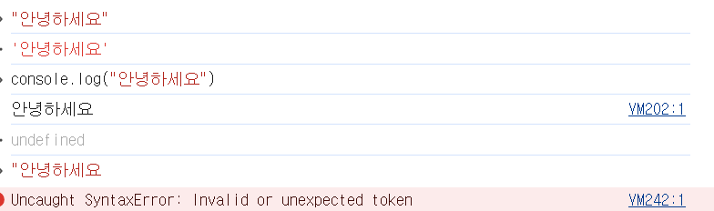
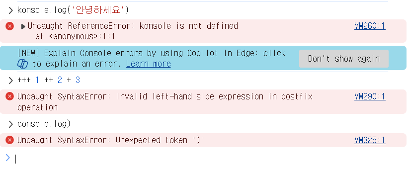

66p. 1번  
  
'안녕하세요'  
안녕하세요  
undefined  
VM242:1 Uncaught SyntaxError: Invalid or unexpected token -> 토큰(기호)을 잘못 입력했을 때의 오류

67p. 2번 안녕하세요

79P.  
1번 O O X O O  
2번 2 식별자

80P.  
3번 2 식별자 4 메소드  
4번

1. weAreTheWorld
2. createOutput
3. createRequest
4. initServer
5. initMatrix

81p  


1. VM260:1 Uncaught ReferenceError: konsole is not defined
   at <anonymous>:1:1
2. Uncaught SyntaxError: Invalid left-hand side expression in postfix operation -> +++ 존재하지않음
3. Uncaught SyntaxError: Unexpected token ')'
   470

100p  
1번 불 숫자 숫자 불  
2번 \\\\  
101p  
3번  
녕  
하  
세  
요  
4번  
0  
4  
114p  
1번 1 const  
2번 2 = (3,4는 비교)

115p  
3-1) VM393:1 Uncaught SyntaxError: Missing initializer in const declaration  
-> const는 선언하면서 함께 초기화해주어야 함  
3-2)  
넓이 = 314  
둘레 = 62.800000000000004  
4번  
11  
11  
13  
13

125p  
1번 3 confirm()  
2번 String(), Boolean()

126p  
3번

```js
const cm = prompt("cm 단위의 숫자를 입력해주세요.");
const inch = cm * 0.393701;
document.write(cm + "cm는 " + inch + "inch 입니다.");
```

4번

```js
const r = prompt("원의 반지름을 입력해주세요");
document.write("원의 반지름: " + r + "<br>");
const area = r * r * 3.14;
document.write("원의 넓이: " + area + "<br>");
const r2 = r * 2 * 3.14;
document.write("원의 둘레: " + r2);
```

5번

```js
const $ = prompt("달러 단위의 금액을 입력해주세요");
document.write("달러: " + $ + "<br>");
const won = $ * 1207;
document.write("→ 원화: " + won);
```

6번
6-1)

```js
const inputYear = prompt("태어난 연도를 입력해주세요");
document.write("출생년도 : " + input + "<br>");
const date = new Date();
const year = date.getFullYear();
const old = year - inputYear + 1;
document.write("올해 나이는 " + old);
```

6-2)

```js
const price = prompt("상품의 금액을 입력해주세요");
document.write("상품금액 : " + price + "원<br>");
const take = prompt("지급받은 액수를 입력해주세요");
document.write("받은 돈 : " + take + "원<br>");
const give = take - price;
document.write("잔돈은 " + give + "원입니다");
```

6-3)

```js
const height = prompt("키를 입력해주세요(m단위로 입력)");
document.write("키 : " + height + "m <br>");
const kg = prompt("몸무게를 입력해주세요(kg)");
document.write("몸무게 : " + kg + "kg <br>");
const bmi = (kg / (height * height)).toFixed(1);
//( ).toFixed(n) 괄호 안의 값의 소수점을 n자리 만큼만 표시
document.write("bmi : " + bmi + "<br>");
if (bmi < 18.5) document.write("저체중 입니다.");
else if (bmi >= 18.5 && bmi < 24.9) document.write("보통입니다.");
else if (bmi >= 24.9 && bmi < 29.9) document.write("과제충입니다.");
else if (bmi >= 29.9 && bmi < 34.9) document.write("1급 비만입니다");
else if (bmi >= 34.9 && bmi < 39.9) document.write("2급 비만입니다");
else document.write("3급 비만입니다.");
```
